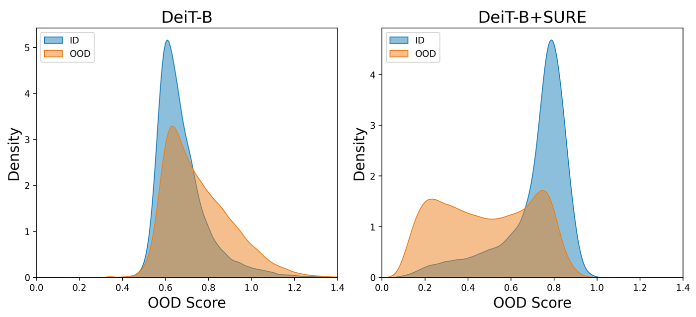
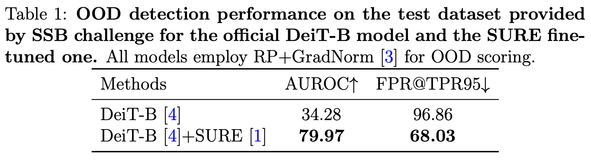

[](https://paperswithcode.com/sota/learning-with-noisy-labels-on-animal?p=sure-survey-recipes-for-building-reliable-and) [](https://paperswithcode.com/sota/image-classification-on-food-101n-1?p=sure-survey-recipes-for-building-reliable-and)


[](https://paperswithcode.com/sota/long-tail-learning-on-cifar-10-lt-r-50?p=sure-survey-recipes-for-building-reliable-and)       [](https://paperswithcode.com/sota/long-tail-learning-on-cifar-10-lt-r-10?p=sure-survey-recipes-for-building-reliable-and) 


# 📝 SURE (CVPR 2024 & ECCV 2024 OOD-CV Challenge Winner)

### Introduction
This is the official implementation of our CVPR 2024 paper *"SURE: SUrvey REcipes for building reliable and robust deep networks".* Our recipes are powerful tools in addressing real-world challenges, such as long-tailed classification, learning with noisy labels, data corruption and out-of-distribution detection. If you find this repo useful, please give it a star ⭐ and consider citing our paper. Thank you.


[](https://openaccess.thecvf.com/content/CVPR2024/papers/Li_SURE_SUrvey_REcipes_for_building_reliable_and_robust_deep_networks_CVPR_2024_paper.pdf) 
[](https://www.ood-cv.org/challenge.html)


[](https://yutingli0606.github.io/SURE/)
[](https://drive.google.com/drive/folders/1xT-cX22_I8h5yAYT1WNJmhSLrQFZZ5t1?usp=sharing)
[](img/poster.pdf)

### News
- **2024.09.26 :**  🏆 🏆 🏆 Our work won the **First place** in [ECCV 2024 OOD-CV Challenge](https://www.ood-cv.org/challenge.html)! More details about our solution can be found in the [SSB-OSR](https://github.com/LIYangggggg/SSB-OSR) repository.
- **2024.02.27 :** :rocket: :rocket: :rocket: Our paper has been accepted by CVPR 2024! 
<p align="center">

</p>

## Table of Content
* [1. Overview of recipes](#1-overview-of-recipes)
* [2. Visual Results](#2-visual-results)
* [3. Installation](#3-installation)
* [4. Quick Start](#4-quick-start)
* [5. Citation](#5-citation)
* [6. Acknowledgement](#6-acknowledgement)

## 1. Overview of recipes
<p align="center">

</p>

## 2. Visual Results
<p align="center">

</p>
<p align="center">

</p>

## 3. Installation

### 3.1. Environment


Our model can be learnt in a **single GPU RTX-4090 24G**

```bash
conda env create -f environment.yml
conda activate u
```

The code was tested on Python 3.9 and PyTorch 1.13.0.


### 3.2. Datasets
#### 3.2.1 CIFAR and Tiny-ImageNet
* Using **CIFAR10, CIFAR100 and Tiny-ImageNet** for failure prediction (also known as misclassification detection).
* We keep **10%** of training samples as a validation dataset for failure prediction. 
* Download datasets to ./data/ and split into train/val/test.
Take CIFAR10 for an example:
```
cd data
bash download_cifar.sh
```
The structure of the file should be:
```
./data/CIFAR10/
├── train
├── val
└── test
```
* We have already split Tiny-imagenet, you can download it from [here.](https://drive.google.com/drive/folders/1xT-cX22_I8h5yAYT1WNJmhSLrQFZZ5t1?usp=sharing)
#### 3.2.2 ImageNet1k and ImageNet21k
* Using **ImageNet1k and ImageNet21k** for detecting out-of-distribution samples.
* For ImageNet, the ImageNet-1K classes (ILSVRC12 challenge) are used as Known, and specific classes from [ImageNet-21K-P](https://arxiv.org/abs/2104.10972) are selected as Unknown.
More details about dataset preparation, see [here](https://github.com/sgvaze/SSB/blob/main/DATA.md).
#### 3.2.3 Animal-10N and Food-101N
* Using **Animal-10N and Food-101N** for learning with noisy label.
* To download Animal-10N dataset [[Song et al., 2019]](https://proceedings.mlr.press/v97/song19b/song19b.pdf), please refer to [here](https://dm.kaist.ac.kr/datasets/animal-10n/). The structure of the file should be:
```
./data/Animal10N/
├── train
└── test
```
* To download Food-101N dataset [[Lee et al., 2018]](https://arxiv.org/pdf/1711.07131.pdf), please refer to [here](https://kuanghuei.github.io/Food-101N/). The structure of the file should be:
```
./data/Food-101N/
├── train
└── test
```
#### 3.2.4 CIFAR-LT
* Using **CIFAR-LT** with imbalance factor(10, 50, 100) for long-tailed classification.
* Rename the original CIFAR10 and CIFAR100 (do not split into validation set) to 'CIFAR10_LT' and 'CIFAR100_LT' respectively.
* The structure of the file should be:
```
./data/CIFAR10_LT/
├── train
└── test
```
#### 3.2.5 CIFAR10-C
* Using **CIFAR10-C** to test robustness under data corrputions.
* To download CIFAR10-C dataset [[Hendrycks et al., 2019]](https://arxiv.org/pdf/1903.12261.pdf), please refer to [here](https://github.com/hendrycks/robustness?tab=readme-ov-file). The structure of the file should be:
```
./data/CIFAR-10-C/
├── brightness.npy
├── contrast.npy
├── defocus_blur.npy
...
```

#### 3.2.6 Stanford CARS
* We additionally run experiments on **Stanford CARS**, which contains 16,185 images of 196 classes of cars. The data is split into 8,144 training images and 8,041 testing images
* To download  the dataset, please refer to [here](http://ai.stanford.edu/~jkrause/cars/car_dataset.html). The structure of the file should be:
```
./data/CARS/
├── train
└── test 
...
```

## 4. Quick Start
* Our model checkpoints are saved [here.](https://drive.google.com/drive/folders/1xT-cX22_I8h5yAYT1WNJmhSLrQFZZ5t1?usp=sharing)
* All results are saved in test_results.csv.
### 4.1 Failure Prediction
* We provide convenient and comprehensive commands in ./run/ to train and test different backbones across different datasets to help researchers reproducing the results of the paper.

<details>
<summary>
Take a example in run/CIFAR10/wideresnet.sh:

</summary>
  <details>
   <summary>
    MSP
   </summary>
    
      python3 main.py \
      --batch-size 128 \
      --gpu 0 \
      --epochs 200 \
      --nb-run 3 \
      --model-name wrn \
      --optim-name baseline \
      --crl-weight 0 \
      --mixup-weight 0 \
      --mixup-beta 10 \
      --save-dir ./CIFAR10_out/wrn_out \
      Cifar10
      
      python3 test.py \
      --batch-size 128 \
      --gpu 0 \
      --nb-run 3 \
      --model-name wrn \
      --optim-name baseline \
      --crl-weight 0 \
      --mixup-weight 0 \
      --save-dir ./CIFAR10_out/wrn_out \
      Cifar10
  </details>

  <details>
   <summary>
    RegMixup
   </summary>
    

      python3 main.py \
      --batch-size 128 \
      --gpu 0 \
      --epochs 200 \
      --nb-run 3 \
      --model-name wrn \
      --optim-name baseline \
      --crl-weight 0 \
      --mixup-weight 0.5 \
      --mixup-beta 10 \
      --save-dir ./CIFAR10_out/wrn_out \
      Cifar10
      
      python3 test.py \
      --batch-size 128 \
      --gpu 0 \
      --nb-run 3 \
      --model-name wrn \
      --optim-name baseline \
      --crl-weight 0 \
      --mixup-weight 0.5 \
      --save-dir ./CIFAR10_out/wrn_out \
      Cifar10

  </details>
  <details>
   <summary>
    CRL
   </summary>
    
      python3 main.py \
      --batch-size 128 \
      --gpu 0 \
      --epochs 200 \
      --nb-run 3 \
      --model-name wrn \
      --optim-name baseline \
      --crl-weight 0.5 \
      --mixup-weight 0 \
      --mixup-beta 10 \
      --save-dir ./CIFAR10_out/wrn_out \
      Cifar10
      
      python3 test.py \
      --batch-size 128 \
      --gpu 0 \
      --nb-run 3 \
      --model-name wrn \
      --optim-name baseline \
      --crl-weight 0.5 \
      --mixup-weight 0 \
      --save-dir ./CIFAR10_out/wrn_out \
      Cifar10

  </details>
  <details>
   <summary>
    SAM
   </summary>
    

      python3 main.py \
      --batch-size 128 \
      --gpu 0 \
      --epochs 200 \
      --nb-run 3 \
      --model-name wrn \
      --optim-name sam \
      --crl-weight 0 \
      --mixup-weight 0 \
      --mixup-beta 10 \
      --save-dir ./CIFAR10_out/wrn_out \
      Cifar10
      
      python3 test.py \
      --batch-size 128 \
      --gpu 0 \
      --nb-run 3 \
      --model-name wrn \
      --optim-name sam \
      --crl-weight 0 \
      --mixup-weight 0 \
      --save-dir ./CIFAR10_out/wrn_out \
      Cifar10

  </details>
  <details>
   <summary>
    SWA
   </summary>
    

      python3 main.py \
      --batch-size 128 \
      --gpu 0 \
      --epochs 200 \
      --nb-run 3 \
      --model-name wrn \
      --optim-name swa \
      --crl-weight 0 \
      --mixup-weight 0 \
      --mixup-beta 10 \
      --save-dir ./CIFAR10_out/wrn_out \
      Cifar10
      
      python3 test.py \
      --batch-size 128 \
      --gpu 0 \
      --nb-run 3 \
      --model-name wrn \
      --optim-name swa \
      --crl-weight 0 \
      --mixup-weight 0 \
      --save-dir ./CIFAR10_out/wrn_out \
      Cifar10

  </details>
  <details>
   <summary>
    FMFP
   </summary>
    

      python3 main.py \
      --batch-size 128 \
      --gpu 0 \
      --epochs 200 \
      --nb-run 3 \
      --model-name wrn \
      --optim-name fmfp \
      --crl-weight 0 \
      --mixup-weight 0 \
      --mixup-beta 10 \
      --save-dir ./CIFAR10_out/wrn_out \
      Cifar10
      
      python3 test.py \
      --batch-size 128 \
      --gpu 0 \
      --nb-run 3 \
      --model-name wrn \
      --optim-name fmfp \
      --crl-weight 0 \
      --mixup-weight 0 \
      --save-dir ./CIFAR10_out/wrn_out \
      Cifar10

  </details>
  <details>
   <summary>
    SURE
   </summary>
    

      python3 main.py \
      --batch-size 128 \
      --gpu 0 \
      --epochs 200 \
      --nb-run 3 \
      --model-name wrn \
      --optim-name fmfp \
      --crl-weight 0.5 \
      --mixup-weight 0.5 \
      --mixup-beta 10 \
      --use-cosine \
      --save-dir ./CIFAR10_out/wrn_out \
      Cifar10
      
      python3 test.py \
      --batch-size 128 \
      --gpu 0 \
      --nb-run 3 \
      --model-name wrn \
      --optim-name fmfp \
      --crl-weight 0.5 \
      --mixup-weight 0.5 \
      --use-cosine \
      --save-dir ./CIFAR10_out/wrn_out \
      Cifar10

  </details>
</details>

Note that : 
* Official **DeiT-B** can be downloaded from [here](https://dl.fbaipublicfiles.com/deit/deit_base_patch16_224-b5f2ef4d.pth)

* Official **DeiT-B-Distilled** can be downloaded from [here](https://dl.fbaipublicfiles.com/deit/deit_base_distilled_patch16_224-df68dfff.pth)

* Then one should set `--deit-path` argument.
<details>
<summary>
Take a example in run/CIFAR10/deit.sh:

</summary>
  <details>
   <summary>
    MSP
   </summary>
    
      python3 main.py \
      --batch-size 64 \
      --gpu 5 \
      --epochs 50 \
      --lr 0.01 \
      --weight-decay 5e-5 \
      --nb-run 3 \
      --model-name deit \
      --optim-name baseline \
      --crl-weight 0 \
      --mixup-weight 0 \
      --mixup-beta 10 \
      --save-dir ./CIFAR10_out/deit_out \
      Cifar10
      
      python3 test.py \
      --batch-size 64 \
      --gpu 5 \
      --nb-run 3 \
      --model-name deit \
      --optim-name baseline \
      --crl-weight 0 \
      --mixup-weight 0 \
      --save-dir ./CIFAR10_out/deit_out \
      Cifar10
  </details>

  <details>
   <summary>
    RegMixup
   </summary>
    

      python3 main.py \
      --batch-size 64 \
      --gpu 5 \
      --epochs 50 \
      --lr 0.01 \
      --weight-decay 5e-5 \
      --nb-run 3 \
      --model-name deit \
      --optim-name baseline \
      --crl-weight 0 \
      --mixup-weight 0.2 \
      --mixup-beta 10 \
      --save-dir ./CIFAR10_out/deit_out \
      Cifar10
      
      python3 test.py \
      --batch-size 64 \
      --gpu 5 \
      --nb-run 3 \
      --model-name deit \
      --optim-name baseline \
      --crl-weight 0 \
      --mixup-weight 0.2 \
      --save-dir ./CIFAR10_out/deit_out \
      Cifar10

  </details>
  <details>
   <summary>
    CRL
   </summary>
    


     python3 main.py \
     --batch-size 64 \
     --gpu 5 \
     --epochs 50 \
     --lr 0.01 \
     --weight-decay 5e-5 \
     --nb-run 3 \
     --model-name deit \
     --optim-name baseline \
     --crl-weight 0.2 \
     --mixup-weight 0 \
     --mixup-beta 10 \
     --save-dir ./CIFAR10_out/deit_out \
     Cifar10
     
     python3 test.py \
     --batch-size 64 \
     --gpu 5 \
     --nb-run 3 \
     --model-name deit \
     --optim-name baseline \
     --crl-weight 0.2 \
     --mixup-weight 0 \
     --save-dir ./CIFAR10_out/deit_out \
     Cifar10

  </details>
  <details>
   <summary>
    SAM
   </summary>
    

      python3 main.py \
      --batch-size 64 \
      --gpu 5 \
      --epochs 50 \
      --lr 0.01 \
      --weight-decay 5e-5 \
      --nb-run 3 \
      --model-name deit \
      --optim-name sam \
      --crl-weight 0 \
      --mixup-weight 0 \
      --mixup-beta 10 \
      --save-dir ./CIFAR10_out/deit_out \
      Cifar10
      
      python3 test.py \
      --batch-size 64 \
      --gpu 5 \
      --nb-run 3 \
      --model-name deit \
      --optim-name sam \
      --crl-weight 0 \
      --mixup-weight 0 \
      --save-dir ./CIFAR10_out/deit_out \
      Cifar10

  </details>
  <details>
   <summary>
    SWA
   </summary>
    

      python3 main.py \
      --batch-size 64 \
      --gpu 5 \
      --epochs 50 \
      --lr 0.01 \
      --weight-decay 5e-5 \
      --swa-epoch-start 0 \
      --swa-lr 0.004 \
      --nb-run 3 \
      --model-name deit \
      --optim-name swa \
      --crl-weight 0 \
      --mixup-weight 0 \
      --mixup-beta 10 \
      --save-dir ./CIFAR10_out/deit_out \
      Cifar10
      
      python3 test.py \
      --batch-size 64 \
      --gpu 5 \
      --nb-run 3 \
      --model-name deit \
      --optim-name swa \
      --crl-weight 0 \
      --mixup-weight 0 \
      --save-dir ./CIFAR10_out/deit_out \
      Cifar10

  </details>
  <details>
   <summary>
    FMFP
   </summary>
    

      python3 main.py \
      --batch-size 64 \
      --gpu 5 \
      --epochs 50 \
      --lr 0.01 \
      --weight-decay 5e-5 \
      --swa-epoch-start 0 \
      --swa-lr 0.004 \
      --nb-run 3 \
      --model-name deit \
      --optim-name fmfp \
      --crl-weight 0 \
      --mixup-weight 0 \
      --mixup-beta 10 \
      --save-dir ./CIFAR10_out/deit_out \
      Cifar10
      
      python3 test.py \
      --batch-size 64 \
      --gpu 5 \
      --nb-run 3 \
      --model-name deit \
      --optim-name fmfp \
      --crl-weight 0 \
      --mixup-weight 0 \
      --save-dir ./CIFAR10_out/deit_out \
      Cifar10


  </details>
  <details>
   <summary>
    SURE
   </summary>
    

      python3 main.py \
      --batch-size 64 \
      --gpu 5 \
      --epochs 50 \
      --lr 0.01 \
      --weight-decay 5e-5 \
      --swa-epoch-start 0 \
      --swa-lr 0.004 \
      --nb-run 3 \
      --model-name deit \
      --optim-name fmfp \
      --crl-weight 0 \
      --mixup-weight 0.2 \
      --mixup-beta 10 \
      --save-dir ./CIFAR10_out/deit_out \
      Cifar10
      
      python3 test.py \
      --batch-size 64 \
      --gpu 5 \
      --nb-run 3 \
      --model-name deit \
      --optim-name fmfp \
      --crl-weight 0 \
      --mixup-weight 0.2 \
      --save-dir ./CIFAR10_out/deit_out \
      Cifar10
  </details>
</details>


<details>
<summary>
The results of failure prediction.
</summary>
<p align="center">

</p>
</details>


### 4.2 Long-tailed classification
* We provide convenient and comprehensive commands in ./run/CIFAR10_LT and ./run/CIFAR100_LT to train and test our method under long-tailed distribution.

<details>
<summary>
Take a example in run/CIFAR10_LT/resnet32.sh:

</summary>
  <details>
   <summary>
    Imbalance factor=10
   </summary>
    
      python3 main.py \
      --batch-size 128 \
      --gpu 0 \
      --epochs 200 \
      --nb-run 3 \
      --model-name resnet32 \
      --optim-name fmfp \
      --crl-weight 0 \
      --mixup-weight 1 \
      --mixup-beta 10 \
      --use-cosine \
      --save-dir ./CIFAR10_LT/res32_out \
      Cifar10_LT
      
      python3 test.py \
      --batch-size 128 \
      --gpu 0 \
      --nb-run 3 \
      --model-name resnet32 \
      --optim-name fmfp \
      --crl-weight 0 \
      --mixup-weight 1 \
      --use-cosine \
      --save-dir ./CIFAR10_LT/res32_out \
      Cifar10_LT
  </details>

  <details>
   <summary>
    Imbalance factor = 50
   </summary>
    
      python3 main.py \
      --batch-size 128 \
      --gpu 0 \
      --epochs 200 \
      --nb-run 3 \
      --model-name resnet32 \
      --optim-name fmfp \
      --crl-weight 0 \
      --mixup-weight 1 \
      --mixup-beta 10 \
      --use-cosine \
      --save-dir ./CIFAR10_LT_50/res32_out \
      Cifar10_LT_50
      
      python3 test.py \
      --batch-size 128 \
      --gpu 0 \
      --nb-run 3 \
      --model-name resnet32 \
      --optim-name fmfp \
      --crl-weight 0 \
      --mixup-weight 1 \
      --use-cosine \
      --save-dir ./CIFAR10_LT_50/res32_out \
      Cifar10_LT_50
      
  </details>
  
  <details>
   <summary>
    Imbalance factor = 100
   </summary>
   
    python3 main.py \
    --batch-size 128 \
    --gpu 0 \
    --epochs 200 \
    --nb-run 3 \
    --model-name resnet32 \
    --optim-name fmfp \
    --crl-weight 0 \
    --mixup-weight 1 \
    --mixup-beta 10 \
    --use-cosine \
    --save-dir ./CIFAR10_LT_100/res32_out \
    Cifar10_LT_100
    
    python3 test.py \
    --batch-size 128 \
    --gpu 0 \
    --nb-run 3 \
    --model-name resnet32 \
    --optim-name fmfp \
    --crl-weight 0 \
    --mixup-weight 1 \
    --use-cosine \
    --save-dir ./CIFAR10_LT_100/res32_out \
    Cifar10_LT_100
  </details>
</details>

You can conduct second stage uncertainty-aware re-weighting by :
```
python3 finetune.py \
--batch-size 128 \
--gpu 5 \
--nb-run 1 \
--model-name resnet32 \
--optim-name fmfp \
--fine-tune-lr 0.005 \
--reweighting-type exp \
--t 1 \
--crl-weight 0 \
--mixup-weight 1 \
--mixup-beta 10 \
--fine-tune-epochs 50 \
--use-cosine \
--save-dir ./CIFAR100LT_100_out/51.60 \
Cifar100_LT_100
```

<details>
<summary>
The results of long-tailed classification.
</summary>
<p align="center">

</p>
</details>

### 4.3 Learning with noisy labels
* We provide convenient and comprehensive commands in ./run/animal10N and ./run/Food101N to train and test our method with noisy labels.

<details>
   
   <summary>
    Animal-10N
   </summary>  
   
     python3 main.py \
     --batch-size 128 \
     --gpu 0 \
     --epochs 200 \
     --nb-run 1 \
     --model-name vgg19bn \
     --optim-name fmfp \
     --crl-weight 0.2 \
     --mixup-weight 1 \
     --mixup-beta 10 \
     --use-cosine \
     --save-dir ./Animal10N_out/vgg19bn_out \
     Animal10N
     
     python3 test.py \
     --batch-size 128 \
     --gpu 0 \
     --nb-run 1 \
     --model-name vgg19bn \
     --optim-name baseline \
     --crl-weight 0.2 \
     --mixup-weight 1 \
     --use-cosine \
     --save-dir ./Animal10N_out/vgg19bn_out \
     Animal10N

  </details>
  <details>
   <summary>
    Food-101N
   </summary>
    

     python3 main.py \
     --batch-size 64 \
     --gpu 0 \
     --epochs 30 \
     --nb-run 1 \
     --model-name resnet50 \
     --optim-name fmfp \
     --crl-weight 0.2 \
     --mixup-weight 1 \
     --mixup-beta 10 \
     --lr 0.01 \
     --swa-lr 0.005 \
     --swa-epoch-start 22 \
     --use-cosine True \
     --save-dir ./Food101N_out/resnet50_out \
     Food101N
     
     python3 test.py \
     --batch-size 64 \
     --gpu 0 \
     --nb-run 1 \
     --model-name resnet50 \
     --optim-name fmfp \
     --crl-weight 0.2 \
     --mixup-weight 1 \
     --use-cosine True \
     --save-dir ./Food101N_out/resnet50_out \
     Food101N

  </details>

  
<details>
<summary>
The results of learning with noisy labels.
</summary>
<p align="center">

</p>
</details> 


### 4.4 Robustness under data corruption
* You can test on CIFAR10-C by the following code in test.py:
```
if args.data_name == 'cifar10':
    cor_results_storage = test_cifar10c_corruptions(net, args.corruption_dir, transform_test,
                                                    args.batch_size, metrics, logger)
    cor_results = {corruption: {
                   severity: {
                   metric: cor_results_storage[corruption][severity][metric][0] for metric in metrics} for severity
                   in range(1, 6)} for corruption in data.CIFAR10C.CIFAR10C.cifarc_subsets}
    cor_results_all_models[f"model_{r + 1}"] = cor_results
``` 
* The results are saved in cifar10c_results.csv.
* Testing on CIFAR10-C takes a while. If you don't need the results, just comment out this code.

<details>
<summary>
The results of failure prediction under distribution shift.
</summary>
<p align="center">

</p>
</details>

### 4.5 Out-of-distribution detection
* You can test on ImageNet by [SSB-OSR](https://github.com/LIYangggggg/SSB-OSR).

<details>
<summary>
The results of out-of-distribution detection.
</summary>
<p align="center">

</p>
</details>

## 5. Citation
If our project is helpful for your research, please consider citing :
```
@InProceedings{Li_2024_CVPR,
    author    = {Li, Yuting and Chen, Yingyi and Yu, Xuanlong and Chen, Dexiong and Shen, Xi},
    title     = {SURE: SUrvey REcipes for building reliable and robust deep networks},
    booktitle = {Proceedings of the IEEE/CVF Conference on Computer Vision and Pattern Recognition (CVPR)},
    month     = {June},
    year      = {2024},
    pages     = {17500-17510}
}

@article{Li2024sureood,
    author    = {Li, Yang and Sha, Youyang and Wu, Shengliang and Li, Yuting and Yu, Xuanlong and Huang, Shihua and Cun, Xiaodong and Chen,Yingyi and Chen, Dexiong and Shen, Xi},
    title     = {SURE-OOD: Detecting OOD samples with SURE},
    month     = {September}
    year      = {2024},
}
```


## 6. Acknowledgement
We refer to codes from [FMFP](https://github.com/Impression2805/FMFP) and [OpenMix](https://github.com/Impression2805/OpenMix). Thanks for their awesome works.


